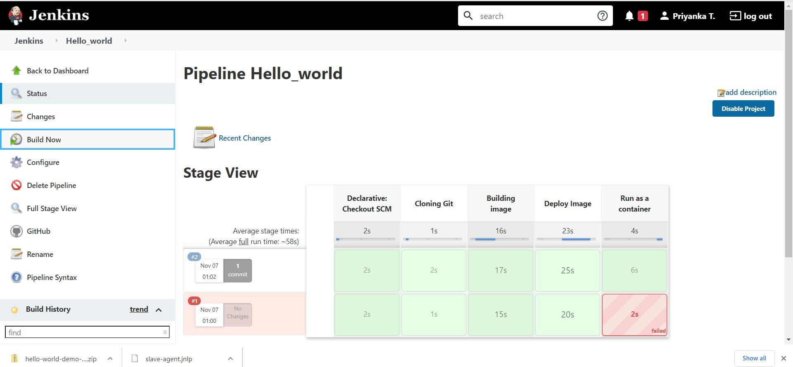

# hello-world-demo
Dockerized hello-world python application on Jenkins pipeline

## **Pipeline**



## **Console Output**
```
Started by user Priyanka T. 
Obtained Jenkinsfile from git https://github.com/priyanka2393/hello-world-demo.git
Running in Durability level: MAX_SURVIVABILITY
[Pipeline] Start of Pipeline
[Pipeline] node
Running on Jenkins in C:\WINDOWS\system32\config\systemprofile\AppData\Local\Jenkins\.jenkins\workspace\Hello_world
[Pipeline] {
[Pipeline] stage
[Pipeline] { (Declarative: Checkout SCM)
[Pipeline] checkout
Selected Git installation does not exist. Using Default
The recommended git tool is: NONE
using credential 2393
 > git.exe rev-parse --is-inside-work-tree # timeout=10
Fetching changes from the remote Git repository
 > git.exe config remote.origin.url https://github.com/priyanka2393/hello-world-demo.git # timeout=10
Fetching upstream changes from https://github.com/priyanka2393/hello-world-demo.git
 > git.exe --version # timeout=10
 > git --version # 'git version 2.28.0.windows.1'
using GIT_ASKPASS to set credentials 
 > git.exe fetch --tags --force --progress -- https://github.com/priyanka2393/hello-world-demo.git +refs/heads/*:refs/remotes/origin/* # timeout=10
 > git.exe rev-parse "refs/remotes/origin/master^{commit}" # timeout=10
Checking out Revision 7560a329f8a3c63580be162ef1990196a4b691b8 (refs/remotes/origin/master)
 > git.exe config core.sparsecheckout # timeout=10
 > git.exe checkout -f 7560a329f8a3c63580be162ef1990196a4b691b8 # timeout=10
Commit message: "Update Jenkinsfile"
 > git.exe rev-list --no-walk 3ab483ca6147911f68db320f79927ec4bc508e09 # timeout=10
[Pipeline] }
[Pipeline] // stage
[Pipeline] withEnv
[Pipeline] {
[Pipeline] withEnv
[Pipeline] {
[Pipeline] stage
[Pipeline] { (Cloning Git)
[Pipeline] git
Selected Git installation does not exist. Using Default
The recommended git tool is: NONE
No credentials specified
 > git.exe rev-parse --is-inside-work-tree # timeout=10
Fetching changes from the remote Git repository
 > git.exe config remote.origin.url https://github.com/priyanka2393/hello-world-demo # timeout=10
Fetching upstream changes from https://github.com/priyanka2393/hello-world-demo
 > git.exe --version # timeout=10
 > git --version # 'git version 2.28.0.windows.1'
 > git.exe fetch --tags --force --progress -- https://github.com/priyanka2393/hello-world-demo +refs/heads/*:refs/remotes/origin/* # timeout=10
 > git.exe rev-parse "refs/remotes/origin/master^{commit}" # timeout=10
Checking out Revision 7560a329f8a3c63580be162ef1990196a4b691b8 (refs/remotes/origin/master)
 > git.exe config core.sparsecheckout # timeout=10
 > git.exe checkout -f 7560a329f8a3c63580be162ef1990196a4b691b8 # timeout=10
 > git.exe branch -a -v --no-abbrev # timeout=10
 > git.exe branch -D master # timeout=10
 > git.exe checkout -b master 7560a329f8a3c63580be162ef1990196a4b691b8 # timeout=10
Commit message: "Update Jenkinsfile"
[Pipeline] }
[Pipeline] // stage
[Pipeline] stage
[Pipeline] { (Building image)
[Pipeline] script
[Pipeline] {
[Pipeline] isUnix
[Pipeline] bat

C:\WINDOWS\system32\config\systemprofile\AppData\Local\Jenkins\.jenkins\workspace\Hello_world>docker build -t priyankat23/flaskapp . 
#2 [internal] load build definition from Dockerfile
#2 transferring dockerfile: 32B 0.1s done
#2 DONE 0.2s

#1 [internal] load .dockerignore
#1 transferring context: 2B 0.1s done
#1 DONE 0.4s

#3 [internal] load metadata for docker.io/library/python:3.6
#3 DONE 0.7s

#4 [1/4] FROM docker.io/library/python:3.6@sha256:62ada7d65aa310020e5278a99...
#4 DONE 0.0s

#5 [internal] load build context
#5 transferring context: 7.03kB 0.1s done
#5 DONE 0.2s

#4 [1/4] FROM docker.io/library/python:3.6@sha256:62ada7d65aa310020e5278a99...
#4 CACHED

#6 [2/4] COPY .  /Hello_world
#6 DONE 0.1s

#7 [3/4] WORKDIR /Hello_world
#7 DONE 0.1s

#8 [4/4] RUN pip install -r requirements.txt
#8 5.801 Collecting Flask==1.1.2
#8 5.938   Downloading Flask-1.1.2-py2.py3-none-any.whl (94 kB)
#8 6.346 Collecting itsdangerous>=0.24
#8 6.365   Downloading itsdangerous-1.1.0-py2.py3-none-any.whl (16 kB)
#8 6.907 Collecting Jinja2>=2.10.1
#8 6.936   Downloading Jinja2-2.11.2-py2.py3-none-any.whl (125 kB)
#8 8.230 Collecting click>=5.1
#8 8.248   Downloading click-7.1.2-py2.py3-none-any.whl (82 kB)
#8 8.520 Collecting Werkzeug>=0.15
#8 8.545   Downloading Werkzeug-1.0.1-py2.py3-none-any.whl (298 kB)
#8 9.162 Collecting MarkupSafe>=0.23
#8 9.187   Downloading MarkupSafe-1.1.1-cp36-cp36m-manylinux1_x86_64.whl (27 kB)
#8 9.528 Installing collected packages: itsdangerous, MarkupSafe, Jinja2, click, Werkzeug, Flask
#8 10.72 Successfully installed Flask-1.1.2 Jinja2-2.11.2 MarkupSafe-1.1.1 Werkzeug-1.0.1 click-7.1.2 itsdangerous-1.1.0
#8 DONE 11.5s

#9 exporting to image
#9 exporting layers
#9 exporting layers 0.6s done
#9 writing image sha256:f0636960f0d3c6ed113d3d8ffafa8d178b39b48cd7865c550df1a09582aaf964
#9 writing image sha256:f0636960f0d3c6ed113d3d8ffafa8d178b39b48cd7865c550df1a09582aaf964 0.1s done
#9 naming to docker.io/priyankat23/flaskapp
#9 naming to docker.io/priyankat23/flaskapp done
#9 DONE 0.8s
[Pipeline] }
[Pipeline] // script
[Pipeline] }
[Pipeline] // stage
[Pipeline] stage
[Pipeline] { (Deploy Image)
[Pipeline] script
[Pipeline] {
[Pipeline] withEnv
[Pipeline] {
[Pipeline] withDockerRegistry
$ docker login -u priyankat23 -p ******** https://index.docker.io/v1/
WARNING! Using --password via the CLI is insecure. Use --password-stdin.
Login Succeeded
[Pipeline] {
[Pipeline] isUnix
[Pipeline] bat

C:\WINDOWS\system32\config\systemprofile\AppData\Local\Jenkins\.jenkins\workspace\Hello_world>docker tag priyankat23/flaskapp priyankat23/flaskapp:2 
[Pipeline] isUnix
[Pipeline] bat

C:\WINDOWS\system32\config\systemprofile\AppData\Local\Jenkins\.jenkins\workspace\Hello_world>docker push priyankat23/flaskapp:2 
The push refers to repository [docker.io/priyankat23/flaskapp]
500e742d77ca: Preparing
5f70bf18a086: Preparing
6331dfe2ce9a: Preparing
00b1a6ab6acd: Preparing
28c41b4dd660: Preparing
36957997ca7a: Preparing
5c4d527d6b3a: Preparing
a933681cf349: Preparing
f49d20b92dc8: Preparing
fe342cfe5c83: Preparing
630e4f1da707: Preparing
9780f6d83e45: Preparing
5c4d527d6b3a: Waiting
a933681cf349: Waiting
f49d20b92dc8: Waiting
fe342cfe5c83: Waiting
630e4f1da707: Waiting
9780f6d83e45: Waiting
36957997ca7a: Waiting
28c41b4dd660: Layer already exists
5f70bf18a086: Layer already exists
00b1a6ab6acd: Layer already exists
a933681cf349: Layer already exists
36957997ca7a: Layer already exists
5c4d527d6b3a: Layer already exists
630e4f1da707: Layer already exists
f49d20b92dc8: Layer already exists
fe342cfe5c83: Layer already exists
9780f6d83e45: Layer already exists
6331dfe2ce9a: Pushed
500e742d77ca: Pushed
2: digest: sha256:8767840ba77eb7dc61a2ccf4109752e4bdc385534009e74d7e4193929108eb7c size: 2843
[Pipeline] isUnix
[Pipeline] bat

C:\WINDOWS\system32\config\systemprofile\AppData\Local\Jenkins\.jenkins\workspace\Hello_world>docker tag priyankat23/flaskapp priyankat23/flaskapp:latest 
[Pipeline] isUnix
[Pipeline] bat

C:\WINDOWS\system32\config\systemprofile\AppData\Local\Jenkins\.jenkins\workspace\Hello_world>docker push priyankat23/flaskapp:latest 
The push refers to repository [docker.io/priyankat23/flaskapp]
500e742d77ca: Preparing
5f70bf18a086: Preparing
6331dfe2ce9a: Preparing
00b1a6ab6acd: Preparing
28c41b4dd660: Preparing
36957997ca7a: Preparing
5c4d527d6b3a: Preparing
a933681cf349: Preparing
f49d20b92dc8: Preparing
fe342cfe5c83: Preparing
630e4f1da707: Preparing
9780f6d83e45: Preparing
36957997ca7a: Waiting
5c4d527d6b3a: Waiting
a933681cf349: Waiting
630e4f1da707: Waiting
9780f6d83e45: Waiting
f49d20b92dc8: Waiting
fe342cfe5c83: Waiting
5f70bf18a086: Layer already exists
28c41b4dd660: Layer already exists
00b1a6ab6acd: Layer already exists
6331dfe2ce9a: Layer already exists
500e742d77ca: Layer already exists
f49d20b92dc8: Layer already exists
5c4d527d6b3a: Layer already exists
a933681cf349: Layer already exists
fe342cfe5c83: Layer already exists
36957997ca7a: Layer already exists
630e4f1da707: Layer already exists
9780f6d83e45: Layer already exists
latest: digest: sha256:8767840ba77eb7dc61a2ccf4109752e4bdc385534009e74d7e4193929108eb7c size: 2843
[Pipeline] }
[Pipeline] // withDockerRegistry
[Pipeline] }
[Pipeline] // withEnv
[Pipeline] }
[Pipeline] // script
[Pipeline] }
[Pipeline] // stage
[Pipeline] stage
[Pipeline] { (Run as a container)
[Pipeline] script
[Pipeline] {
[Pipeline] bat

C:\WINDOWS\system32\config\systemprofile\AppData\Local\Jenkins\.jenkins\workspace\Hello_world>docker run -p 8000:8000 --name flask_cont -d priyankat23/flaskapp 
0e7ad7ce57615f76a650c952f12066f7f6b3d0f7d59e418633a008ce93c0790e
[Pipeline] }
[Pipeline] // script
[Pipeline] }
[Pipeline] // stage
[Pipeline] }
[Pipeline] // withEnv
[Pipeline] }
[Pipeline] // withEnv
[Pipeline] }
[Pipeline] // node
[Pipeline] End of Pipeline
Finished: SUCCESS
```
